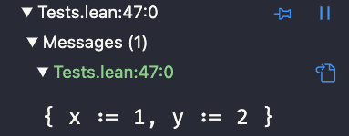

# The Calculus of Inductive Constructions

From now on, we will use the Lean 4 VS Code extension to introduce the concepts.

## Comparisons with the C programming language

In this alternative foundation of mathematics, the calculus of inductive constructions, functions are considered a primitive concept.

For instance, let's define addition:


```lean hljs
def add (x y : Nat) : Nat := x + y
```

As you can see, the function is strongly typed as well which is another difference from set theory.

We can define structures as in `C`:

```lean hljs
structure Point where
  x : Int16
  y : Int16
  deriving Repr
```

`deriving Repr` tells Lean 4 to generate an instance of the typeclass `Repr` so the structure can be displayed in the info view.

Now, you can build a `Point` to see the result in the info view:

```lean hljs
#eval Point.mk 1 2
```

If you place the cursor on that line in VS Code's editor, the info view should now display:



A structure can be polymorphic so that `Point` could have been defined as:

```lean hljs
structure Point (t : Type) where
  x : t
  y : t
  deriving Repr
```

It is similar to what you can do in other programming languages.

As in `C`, you can create enumerations and unions. Lean 4 provides inductive types for this. Here are some examples:

```lean hljs
inductive MyColors where
  | red 
  | green
  | blue
  | yellow
  deriving Repr
```

In `C`, you would have written:

```C
enum MyColor {
 red,green,blue,yellow
};
```

Let's see how to represent the following `C` structure including a union:

```C
struct IntOrFloat 
{
   int tag;
   union {
      int i;
      float f;
   } value;
};
```

In Lean 4, you would write:

```lean hljs
inductive IntOrFloat where
  | int (i : Int)
  | float (f : Float)
  deriving Repr
```

`int` and `float` replace the tag in the `C` structure. You can't define an union without a tag to know which case should be selected.

`int` and `float` are also constructors: the only way to create elements of this type.

```lean hljs
#check IntOrFloat.int 3
```

`#check` is useful to get the type of an expression. As shown in the info view, the type is `IntOrFloat`.


In `C` you would have written:

```C
mystruct.tag = 0;
mystruct.value.i = 3;
```

Then, in `C` to extract and process a value from the union, you would write:

```C
if (mystruct.tag == 0)
{
    process_int(mystruct.value.i);
}
if (mystruct.tag == 1)
{
    process_float(mystruct.value.f);
}
```

In Lean 4, you write:

```lean hljs
def f (s : IntOrFloat) : String :=
  match s with
  | .int i => s!"{i}"
  | .float f => s!"{f}"
```

We have defined a function that translates the content into a string. The only way to access the content is through the `match`. Unlike `C`, where you could forget to check the tag before accessing a field, with `match` you are required to check the tag.

`inductive` types are powerful: they can be polymorphic and recursive. Here is the definition of a binary tree:

```lean hljs
inductive BinaryTree (a : Type) where
  | leaf (x : a)
  | node (l r : BinaryTree a)
  deriving Repr
```

The `node` constructor takes the left and right trees as arguments.

```lean hljs
#eval BinaryTree.node (BinaryTree.leaf 1) (BinaryTree.leaf 2)
```

Now, you may be wondering what the relationship is with proofs, theorems, predicates, etc. So far, I have just  presented a new programming language.

Before answering, I need to introduce a few definitions.

```lean hljs
structure Pair (a b : Type) where
  left : a
  right : b
  deriving Repr
```

```lean hljs
inductive Either (a b : Type) where
  | left (x : a)
  | right (y : b)
  deriving Repr
```

```lean hljs
def g {a b : Type} (x : Pair a (Pair b a)) : a := x.right.right
```

Function `g` is polymorphic. The types are arguments to the function. This is different from some other polymorphic languages, where the types are information about the arguments but not arguments themselves.

In most cases, Lean 4 can guess those arguments so they are marked as being implicit using `{}` instead of `()`. If Lean 4 can't guess the types, you would have to provide them.

As a consequence, `g` could be used as `g x` if the type `a` and `b` can be inferred from the value `x`. Otherwise, you may have to write something like `@g Int Float x` where `@g` refers to the form with all implicit arguments made explicit.

## Logic and proofs

Logic is often presented in Hilbert style where there is only one rule and an infinity many axioms : axiom schemas.

The rule is modus ponens: if `A` is true and `A` implies `B` then `B` is true.

Axiom schemas may look like:

\\[
A → B → A
\\]

This means it is postulated as true for any `A` and `B`.

I have never found this way of presenting logic very intuitive. I prefer another presentation which highlights the link with programming languages: natural deduction.

In natural deduction, there are no axioms and only rules. 

For each logical connective, there are rules for introducing it and eliminating it.

For instance, for the `AND` logical connective:

* If  proposition `A` is true and `B` is true then `A ∧ B` is true. Let's call this rule `And.intro`.
* If `A ∧ B` is true then we can either deduce `A` using the rule `And.left` or we can deduce `B` with `And.right`. Both rule eliminate `∧`

How can we prove:

\\[
A ∧ B ∧ A → A
\\]

Using the rule, if the starting proposition is `p`, we can write:

\\[
And.right(And.right(p))
\\]

In Lean 4, I would write it as:

```lean hljs
def proof {a b : Prop} (p : a ∧ b ∧ a) : a := p.right.right
```

Compare with the function `g` we had written for the `Pair` datatype:

```lean hljs
def g {a b : Type} (x : Pair a (Pair b a)) : a := x.right.right
```

We see on this example the similarities between types and propositions on one hand, and proofs and programs on the other hand. It is the [Curry-Howard correspondence](https://en.wikipedia.org/wiki/Curry–Howard_correspondence).

Writing specifications of your programs and proving those specifications hold for a given implementation is no different than programming. But you will be programming with a language where types, proofs and propositions can be manipulated like values in other languages.

See how we can prevent division by zero:

```lean hljs

def div (x y : Int) (no_zero : y != 0): Int :=
  x / y
```

This function takes two `Ints` as arguments and the third argument is a proof that `y` is not zero.

To use this function in your program you have to provide the proof.

But with proofs, we are not interested in what is computed. With programs, if you expect a result `3` and you get `10` it is a bug. With proofs, you are only interested in the existence of a proof: the goal is to have a program that typechecks.

In this context, it is easier to let the computer write some parts of the proof. You can write some parts of the proof as program as it was done before. But you can rely on powerful macros - called tactics - that will generate some parts of those proofs when you build you program.

Let's revisit our first proof:

```lean hljs
def proof {a b : Prop} (p : a ∧ b ∧ a) : a := p.right.right
```

Since it is a proof, we are not interested in what is computed but only in the existence of the program. We tell Lean 4 about it by replacing `def` with `theorem`:

```lean hljs
theorem proof {a b : Prop} (p : a ∧ b ∧ a) : a := p.right.right
```

Now, we want to use some tactics to prove this theorem instead of having to write the program:

```lean hljs
theorem proof {a b : Prop} (p : a ∧ b ∧ a) : a := by 
  simp_all
```

`by` is used to enter the tactic mode. Several tactics can be applied in sequence. Here we have used the tactic `simp_all`. Lean 4 has an extensible database of theorems used to simplify expressions, which it is used here to prove that `a ∧ b ∧ a` implies `a`.

We have focused on the `AND` logical connective. `OR` is similar to the `Either` datatype we have introduced earlier.

To summarize:
* Types (`Int`, `String` ...) live in the `Types` universes
* Propositions (`3=2`, `4 is even` ...) live in the `Prop` universe but otherwise propositions are similar to types

* Programs are written with `def`. 
* Proof are written using `theorem`. 
* Tactics are available to assist with code generation and are mostly used in the `theorem` context.

In mathematics, we need predicates: propositions that depend on variables. For instance, one may want to define the predicate `isEven n` for `n` an integer. `isEven 2`, `isEven 3` ... are different propositions. Similarly, in the type universe, `Vector 2 Float` and `Vector 3 Float` would be different types for vectors of different lengths.

`Vector n Float` is a dependent type because it depends on the value `n`. Dependent types and propositions are very powerful and necessary to express complex properties.

In next chapter, we will look at a few examples to see how all of this could be used by an embedded developer.