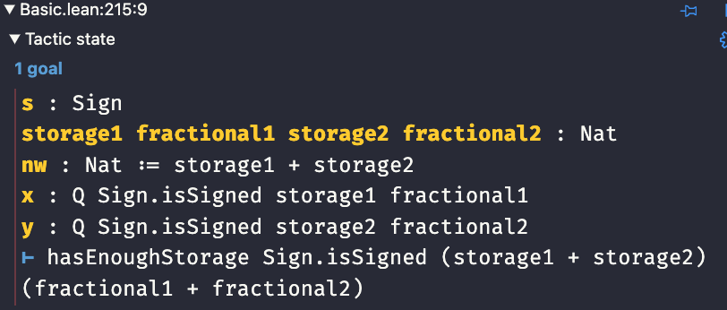
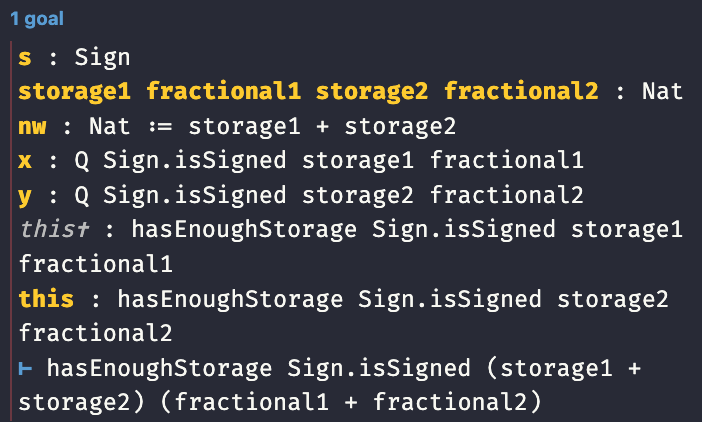

# Examples

We have seen that mathematics can be built on another foundation: a programming language! But it is not your typical programming language. It is a language where the frontier between values, types, proofs, programs are becoming fuzzy.
It is a language with powerful concepts like inductive types and dependent types.

You can use this language like any other one and write programs. But you can benefit from all of its powerful features to better specify or constrain the behavior of your programs.

In short: you can write executable specifications that you can use to validate and test your other implementations, written for instance in `C`.

You can go further with libraries developed within the ecosystem. For instance, in the Lean 4 ecosystem, Amazon has developed a [library](https://github.com/leanprover/LNSym) that models parts of the Arm v8 instruction set. You could use such a library to validate code sequences which can be very useful in applications such as cryptography.

As part of this quick tutorial, I have written a [small library](https://github.com/christophe0606/FixedPointLean) to illustrate some ideas in the context to fixed-point arithmetic.

This book is part of the github repository for this library.

Let's review some extracts from the library.

## Fixed point datatype

Our fixed-point number datatype is built with the Lean 4 datatype `BitVec w` which is a bit vector of width `w`.

A fixed-point number can be signed or unsigned. For a given bit width, it can have different sizes for the fractional part. 

We want to encode all of this in the datatype.

First, let's define the `Sign` datatype:

```lean hljs
/-- Fixed point numbers can be signed or unsigned -/
inductive Sign where
| isSigned
| isUnsigned
deriving Repr
```

Let's define a utility function to determine how many bits are required to encode the sign:

```lean hljs
def signStorage (s : Sign) : Nat :=
  match s with
  | .isSigned => 1
  | .isUnsigned => 0
```

We need enough bits in the `BitVec` to encode the sign bit and the fractional part. The remaining bits (if any) are used for the integer part.

Let's define a property to check this:

```lean hljs
def hasEnoughStorage (s : Sign) (storage : Nat) (fractional : Nat) : Prop :=
  signStorage s + fractional ≤ storage
```

As you can see, it is a `Prop`.

Now, we can define our fixed-point datatype:

```lean hljs
structure Q (s : Sign) (storage : Nat) (fractional : Nat) where
  val : BitVec storage
  enough_storage : hasEnoughStorage s storage fractional := by decide
  fractional_not_zero : 0 < fractional  := by decide
  deriving BEq,Ord
```

The structure contains three fields:
* The `BitVec` containing the value
* A proof that enough bits are available to store the sign and fractional part
* A proof that the fractional part has at least one bit !

We define default proofs for the last two fields. Those default proofs are generated by the `decide` tactic.

It means that, in practice, proofs need to be provided only when the `decide` tactic fails. 

Let's define an abbreviation and start using it:

```lean hljs
abbrev sq7 := Q .isSigned 8 7
```

Now, let's use the `sq7` datatype:

```lean hljs
#eval (0xFF#8 : sq7)
```

The info view displays `-1`. No proof needs to be given. The bit vector was given using the Lean 4 syntax: `0xFF#8` for a `BitVec 8`.

## Fixed-point multiplication

Specifying the multiplication is an interesting exercise since the output format is not the same as the input.

In Lean 4, we implements an instance of the `HMul` type class to override the `*` operator.

But, I'll present things as if I was only implementing a `mul` function.

The type could be:
```lean hljs
def mul (x:Q s storage1 fractional1)
        (y:Q s storage2 fractional2) :
        (Q s (storage1 + storage2 : Nat) (fractional1 + fractional2)) := ...

```

We see that the output fixed-point has a bigger bit width, and more bits for the fractional part.
We also see that `x` and `y` must both be signed or unsigned since they use the same type variable `s`.

To implement the function, we will need to provide the proofs that are required to build the result.

We have some properties available inside `x` and `y` that we can use.

```lean hljs
 :=
    let nw := storage1 + storage2
    match s with
    | .isSigned => .mk (x.val.signExtend nw * y.val.signExtend nw)
      (by
          have := x.enough_storage
          have := y.enough_storage
          omega
      )
      ( by have := x.fractional_not_zero
           have := y.fractional_not_zero
           omega
      )
    | .isUnsigned => .mk (x.val.zeroExtend nw * y.val.zeroExtend nw)
       (by
          have := x.enough_storage
          have := y.enough_storage
          omega
      )
      ( by have := x.fractional_not_zero
           have := y.fractional_not_zero
           omega
      )
```

Let's explain it line per line:

```lean hljs
 :=
    let nw := storage1 + storage2
```

`nw` is the amount of bits needed for the output bit vector.

Then, we pattern match on the sign and have two cases to consider. I'll only explain the signed case.

```lean hljs
| .isSigned => .mk
```

`.mk` is `Output datatype.mk`. It is a short way to write the result. `.mk` is the constructor of the `Q` structure. We have seen there are three fields in this structure : the bit vector and two proofs for two properties.

The value is given by `x.val.signExtend nw * y.val.signExtend nw`

The fixed-point as interpreted as signed (hence the `.signExtend` and they are multiplied as bit vectors).

The second argument to `.mk` must be a proof of the property: `signStorage s + fractional ≤ storage` for the output fractional and storage values.

The proof is:

```lean hljs
by
    have := x.enough_storage
    have := y.enough_storage
    omega
```

We the `have` tactic, we introduce what we know. The properties true in `x` and `y` that we need.
`omega` is a powerful tactic than can solve integer and linear arithmetic problems. Here our problems it to prove an inequality.

Writing proofs is interactive, you need to look at the info view. If you put the cursor just after `by`, the info view displays the goal remaining to be proved and the known assumptions at this point:



If you put the cursor have the `have`, you'll see two new assumptions named `this` with the `enough_storage` properties for `x` and `y`



And if you put the cursor after `omega`:


No remaining goal to prove !
